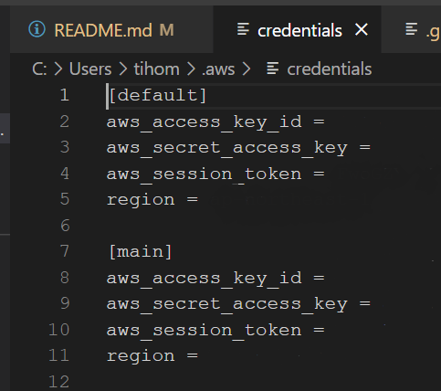
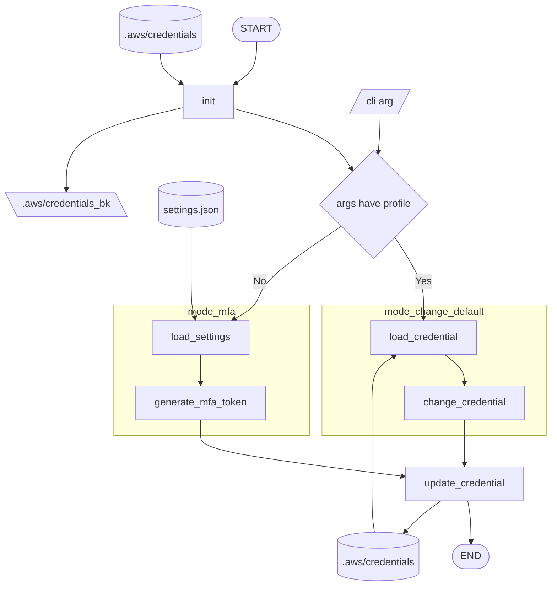

# aws_cli_setup

aws cli をmfa認証で使用している場合に特化して実装。

1. コマンド一つですべてのプロファイルのmfa認証を実行
2. コマンド一つでデフォルトのプロファイルを切り替え

<!-- 初使用。手動調整できないところが痒いな。
だからこそ一貫性が保てるというのもあるけど。 -->

# 使用法

## 前提

例外処理はほとんどしていない。
安定的に動作するまで、デバッグ実行！

mfaの設定と認証はしておく必要があるので、最初は"WinAuth"などを使用する。

## settings.json

settings copy.json
をコピーして
settings.jsonを作成

任意の数プロファイルを作成する。

## お好み設定

* タスクスケジューラで起動時に設定
* コマンドパスを追加

## mode_mfa
コマンド一つですべてのプロファイルのmfa認証を実行

aws_cli_setup.pyを実行

## mode_change_profile
コマンド一つでデフォルトのプロファイルを切り替え

* aws_cli_setup.py実行時、 引数にプロファイルの文字列を指定
  * MFA認証は実施されず、指定したプロファイルの内容が[default]に設定される。

# todo

pip install したい？

chromeの認証も自動化したい。
→[こちら](https://github.com/ichir0roie/chrome-mfa-login)